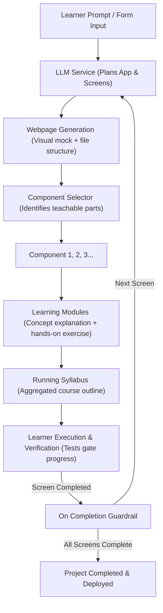
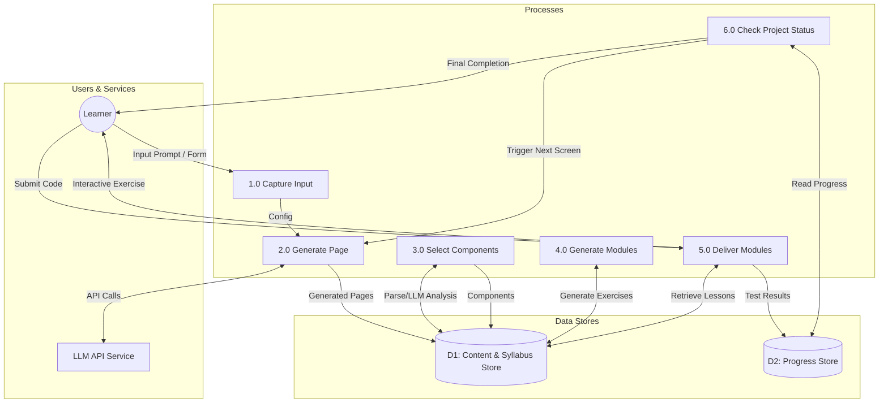
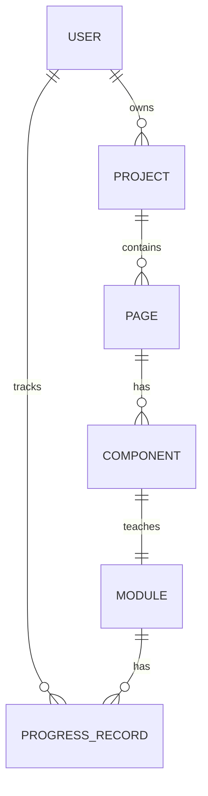

# Ascent: Project-Based AI Coding Academy

Ascent is a web application that teaches developers how to code by guiding them through building real, specific projects of their choice instead of following generic tutorials. 

---

## 1. What is Ascent?

Rather than following passive, abstract tutorials, learners describe exactly what they want to build (e.g., *"An e-commerce site using React"*) or select from a guided form specifying the project type and tech stack. 

An AI then plans and delivers a customized course, teaching each concept exactly when it is needed to build the next part of that project. By the end of the course, the learner has both mastered the educational material and completed a finished, deployed version of their project.

---

## 2. Core Product Concept

Ascent is designed to directly target **"tutorial hell"**—the state where developers follow tutorials, understand the material in the moment, but remain unable to build something of their own from scratch.

*   **Tied to Real Projects:** Every lesson is directly tied to a feature or component of the project the learner selected, giving every programming concept a concrete reason to exist.
*   **Screen-by-Screen Progression:** The course is organized screen-by-screen (e.g., Home, Product Listing, Cart, Checkout) rather than by abstract topics. Each screen serves as a visible unit of progress.
*   **Teach-Then-Build Pedagogy:** Learners write the implementation themselves, guided by a conceptual lesson. This is a deliberate choice against the more common "AI builds it, then explains it" pattern.
*   **Anti-Tutorial-Hell Guardrails:** The platform provides hints before answers, requires a verification attempt before revealing solutions, and gates progress using automated tests.

---

## 3. Competitive Landscape

Ascent differentiates itself from other developer education platforms by combining highly customized project selection with a strict "teach-first, build-second" structure:

| Platform | Target Audience / Focus | Approach | Difference from Ascent |
| :--- | :--- | :--- | :--- |
| **CodeCrafters** | Experienced engineers | Rebuilding systems (Git, Redis) in local environments with Git-based tests. | Fixed menu of backend/systems projects, not open-ended. |
| **Boot.dev** | Aspiring backend developers | Gamified, backend-focused (Python/Go) with a Socratic AI tutor. | Curated backend paths rather than open-ended project building. |
| **Codecademy AI Builder** | General learners | Generates prototype first, then reverse-engineers curriculum. | **Builds first, teaches second.** Tends to foster "vibe coding" with lower retention. |
| **Ascent (This Product)** | All levels | Generates curriculum, teaches concepts, gates code verification. | **Teaches first, builds second.** Fully open-ended projects + ambitious systems architecture. |

---

## 4. End-to-End Product Flow

The workflow below outlines how user input is converted into a structured curriculum and step-by-step interactive modules.



### Detailed Flow Steps
1. **Prompt / Form:** The learner enters a direct prompt or picks a project type and tech stack.
2. **LLM:** The LLM plans the application architecture and plans the screens.
3. **Webpage:** The LLM generates a visual layout and basic file-structure for the target screen.
4. **Component Selector:** Scans the webpage and identifies teachable components.
5. **Modules:** Each component is converted into an individual learning module consisting of a conceptual lesson and a coding exercise.
6. **Syllabus:** The running syllabus accumulates these modules into an ordered learning path.
7. **On Completion:** Once a webpage's modules are completed, the loop requests the next page from the LLM, repeating until the project is fully built.

---

## 5. System Design & Data Flow

Ascent is composed of interactive processes linking the Learner, the LLM service, and two primary data stores.



### Data Stores
*   **D1: Content & Syllabus Store:** Holds generated pages, components, syllabus, and modules.
*   **D2: Progress Store:** Tracks module completions, attempts, and verification test results.

---

## 6. Backend Architecture

### Architectural Style
We utilize a **modular monolith** style. This provides the operational simplicity of a single deployable backend service, while enforcing strict module boundaries so that high-load modules (like Code Execution) can be split into microservices later if necessary.

### Core Modules
*   **API Layer (BFF):** Entry point for the frontend; handles authentication, routing, and rate-limiting.
*   **Project Planning Module:** Orchestrates initial prompt handling and screen roadmaps.
*   **Generation Orchestrator:** Manages LLM calls (page generation, component selection, module generation). Centralizes templates, retry logic, and usage costs.
*   **Content & Syllabus Module:** Manages the relational database entities for generated content.
*   **Progress Module:** Tracks user learning logs, compilation attempts, and gates.
*   **Code Execution Module:** Runs test suites against user code. Uses in-browser sandboxes (e.g., WebContainers, Sandpack) alongside a server-side verification check to prevent client-side spoofing.
*   **Auth Module:** Standard session and account management.

### Data Model (Key Entities)



*   **User**: Account details.
*   **Project**: Owner, source prompt/form, tech stack choice, status.
*   **Page**: Parent project, generated HTML/JS code, file structure layout, order index, status.
*   **Component**: Parent page, layout location, name.
*   **Module**: Parent component, conceptual content, hands-on exercise, verification tests.
*   **ProgressRecord**: User x Module link tracking status, attempt count, and completion timestamps.

### API Surface

```http
# Projects & Roadmaps
POST /projects                       # Create a project from prompt/form choice
GET  /projects/:id/roadmap           # Retrieve the planned screen roadmap

# Content Generation
POST /projects/:id/pages/:idx/gen    # Generate specific page structure
GET  /projects/:id/pages/:pId/comps  # Retrieve components from a page
GET  /projects/:id/pages/:pId/mods   # Get generated learning modules for components
GET  /projects/:id/syllabus          # Retrieve compilation of all project modules

# Interactive Learning
POST /modules/:id/submit             # Submit code implementation for verification
GET  /modules/:id/hint               # Request context-specific hint
GET  /projects/:id/progress          # Get overall learning progress
```

### Suggested Tech Stack
*   **Backend:** Node.js/TypeScript (shares types with frontend) or Python.
*   **Database:** PostgreSQL (highly relational structure).
*   **Queue/Cache:** Redis (essential for managing long-running LLM generation queues asynchronously).
*   **Execution Sandbox:** WebContainers (StackBlitz) or Sandpack (CodeSandbox) in-browser.
*   **Frontend:** React.

---

## 7. Key Product Decisions Already Made

1.  **Teach-then-Build Sequencing:** The learner must write the actual implementation code; the AI does not write the code for them.
2.  **Screen-by-Screen Structure:** Education is framed around real screens the user wants to build.
3.  **Active Verification Gates:** Automated tests must pass to unlock progression; hints are provided step-by-step to prevent cheating or getting stuck.
4.  **Vertical-Slice Progression:** Get a crude but functional end-to-end interface working early, then layer in complex functionalities.
5.  **Scope Negotiation:** Prompts like "Netflix clone" are automatically scoped down to a realistic learning v1 rather than a full production stack.

---

## 8. Open Questions (To Be Decided)

> [!IMPORTANT]
> The following core decisions are pending and will heavily impact the initial engineering estimates:

1.  **Primary Target User:** Are we building for complete programming beginners (slower, broader pacing) or developers who know syntax but struggle to build end-to-end projects (narrower, faster pace)?
2.  **Content-Generation Strategy:** Fully generative LLM content on the fly, a curated library of pre-authored courses mapped dynamically, or a hybrid approach?
3.  **Backend Integration:** Does each screen module bundle its own backend logic, or start on mock data and integrate real backend/API calls later? (Currently leaning mock-first).
4.  **Initial Setup:** Do we present a dedicated "Project Setup" module (routing, state-management setup) before Page 1, or embed setup tasks directly inside the first page module? (Currently leaning explicit setup).
5.  **Roadmap Visibility:** Should the user see the entire project roadmap upfront with details generated lazily, or should the roadmap adapt and reveal itself screen-by-screen?

---

## 9. Next Steps

1.  **Settle Target User:** Define the primary persona to anchor the curriculum depth and user interface design.
2.  **Choose Content Generation Architecture:** Validate LLM capability to dynamically generate structured modules reliably.
3.  **End-to-End Prototype:** Build a single-screen prototype (one page, one component, one generated lesson) to test the teach-then-build loop manually before building the backend orchestrator.
