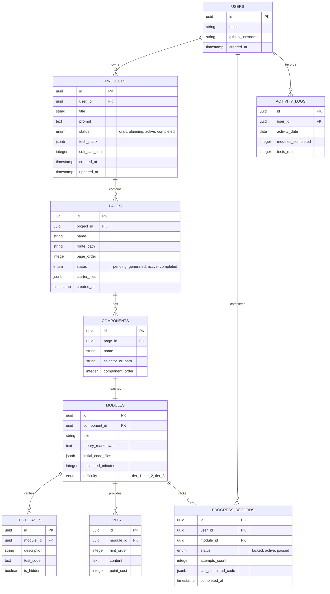

# Ascent — Database & Data Model Specification

This document details the relational database schema (PostgreSQL), caching strategy (Redis), Entity-Relationship diagrams, and data flows across all screens for the **Ascent** AI-powered coding platform.

---

## 1. Entity-Relationship Diagram



---

## 2. PostgreSQL Schema DDL

```sql
-- Enable UUID extension
CREATE EXTENSION IF NOT EXISTS "uuid-ossp";

-- Enum Types
CREATE TYPE project_status AS ENUM ('draft', 'planning', 'active', 'completed');
CREATE TYPE page_status AS ENUM ('pending', 'generated', 'active', 'completed');
CREATE TYPE progress_status AS ENUM ('locked', 'active', 'passed');
CREATE TYPE difficulty_tier AS ENUM ('tier_1', 'tier_2', 'tier_3');

-- 1. Users Table
CREATE TABLE users (
    id UUID PRIMARY KEY DEFAULT uuid_generate_v4(),
    email VARCHAR(255) UNIQUE NOT NULL,
    github_username VARCHAR(100),
    skill_calibration JSONB DEFAULT '{}'::jsonb,
    created_at TIMESTAMP WITH TIME ZONE DEFAULT CURRENT_TIMESTAMP,
    updated_at TIMESTAMP WITH TIME ZONE DEFAULT CURRENT_TIMESTAMP
);

-- 2. Projects Table
CREATE TABLE projects (
    id UUID PRIMARY KEY DEFAULT uuid_generate_v4(),
    user_id UUID NOT NULL REFERENCES users(id) ON DELETE CASCADE,
    title VARCHAR(255) NOT NULL,
    prompt TEXT NOT NULL,
    status project_status DEFAULT 'draft',
    tech_stack JSONB NOT NULL DEFAULT '[]'::jsonb,
    soft_cap_limit INT DEFAULT 12,
    active_page_id UUID,
    created_at TIMESTAMP WITH TIME ZONE DEFAULT CURRENT_TIMESTAMP,
    updated_at TIMESTAMP WITH TIME ZONE DEFAULT CURRENT_TIMESTAMP
);

-- 3. Pages Table
CREATE TABLE pages (
    id UUID PRIMARY KEY DEFAULT uuid_generate_v4(),
    project_id UUID NOT NULL REFERENCES projects(id) ON DELETE CASCADE,
    name VARCHAR(255) NOT NULL,
    description TEXT,
    route_path VARCHAR(255) NOT NULL,
    page_order INT NOT NULL,
    status page_status DEFAULT 'pending',
    starter_files JSONB DEFAULT '{}'::jsonb,
    created_at TIMESTAMP WITH TIME ZONE DEFAULT CURRENT_TIMESTAMP,
    UNIQUE(project_id, page_order)
);

-- 4. Components Table
CREATE TABLE components (
    id UUID PRIMARY KEY DEFAULT uuid_generate_v4(),
    page_id UUID NOT NULL REFERENCES pages(id) ON DELETE CASCADE,
    name VARCHAR(255) NOT NULL,
    selector_or_path VARCHAR(255) NOT NULL,
    component_order INT NOT NULL
);

-- 5. Modules Table
CREATE TABLE modules (
    id UUID PRIMARY KEY DEFAULT uuid_generate_v4(),
    component_id UUID UNIQUE NOT NULL REFERENCES components(id) ON DELETE CASCADE,
    title VARCHAR(255) NOT NULL,
    theory_markdown TEXT NOT NULL,
    initial_code_files JSONB NOT NULL DEFAULT '{}'::jsonb,
    estimated_minutes INT DEFAULT 15,
    difficulty difficulty_tier DEFAULT 'tier_2',
    created_at TIMESTAMP WITH TIME ZONE DEFAULT CURRENT_TIMESTAMP
);

-- 6. Test Cases Table
CREATE TABLE test_cases (
    id UUID PRIMARY KEY DEFAULT uuid_generate_v4(),
    module_id UUID NOT NULL REFERENCES modules(id) ON DELETE CASCADE,
    description VARCHAR(255) NOT NULL,
    test_code TEXT NOT NULL,
    is_hidden BOOLEAN DEFAULT false,
    test_order INT NOT NULL
);

-- 7. Hints Table
CREATE TABLE hints (
    id UUID PRIMARY KEY DEFAULT uuid_generate_v4(),
    module_id UUID NOT NULL REFERENCES modules(id) ON DELETE CASCADE,
    hint_order INT NOT NULL,
    content TEXT NOT NULL,
    point_cost INT DEFAULT 0
);

-- 8. Progress Records Table
CREATE TABLE progress_records (
    id UUID PRIMARY KEY DEFAULT uuid_generate_v4(),
    user_id UUID NOT NULL REFERENCES users(id) ON DELETE CASCADE,
    module_id UUID NOT NULL REFERENCES modules(id) ON DELETE CASCADE,
    status progress_status DEFAULT 'locked',
    attempts_count INT DEFAULT 0,
    hints_unlocked INT DEFAULT 0,
    last_submitted_code JSONB DEFAULT '{}'::jsonb,
    last_active_file VARCHAR(255),
    completed_at TIMESTAMP WITH TIME ZONE,
    updated_at TIMESTAMP WITH TIME ZONE DEFAULT CURRENT_TIMESTAMP,
    UNIQUE(user_id, module_id)
);

-- 9. Activity Logs Table (Streak & Heatmap)
CREATE TABLE activity_logs (
    id UUID PRIMARY KEY DEFAULT uuid_generate_v4(),
    user_id UUID NOT NULL REFERENCES users(id) ON DELETE CASCADE,
    activity_date DATE NOT NULL,
    modules_completed INT DEFAULT 0,
    tests_run INT DEFAULT 0,
    UNIQUE(user_id, activity_date)
);

-- Indexes for performance optimization
CREATE INDEX idx_projects_user_id ON projects(user_id);
CREATE INDEX idx_pages_project_id ON pages(project_id);
CREATE INDEX idx_components_page_id ON components(page_id);
CREATE INDEX idx_progress_user_module ON progress_records(user_id, module_id);
CREATE INDEX idx_activity_user_date ON activity_logs(user_id, activity_date);
```

---

## 3. Syllabus View Definition

The running syllabus is dynamically compiled from pages, components, modules, and user progress records.

```sql
CREATE VIEW syllabus_view AS
SELECT 
    p.id AS project_id,
    pg.id AS page_id,
    pg.name AS page_name,
    pg.page_order,
    pg.status AS page_status,
    c.id AS component_id,
    c.name AS component_name,
    c.component_order,
    m.id AS module_id,
    m.title AS module_title,
    m.estimated_minutes,
    COALESCE(pr.status, 'locked') AS user_progress_status,
    COALESCE(pr.attempts_count, 0) AS attempts_count,
    pr.completed_at
FROM projects p
JOIN pages pg ON p.id = pg.project_id
JOIN components c ON pg.id = c.page_id
JOIN modules m ON c.id = m.component_id
LEFT JOIN progress_records pr ON m.id = pr.module_id
ORDER BY pg.page_order ASC, c.component_order ASC;
```

---

## 4. Redis Cache & Queue Architecture

```
Key Pattern                               Type       Purpose
-------------------------------------------------------------------------------------------------------
ascent:queue:llm_generation              List       Asynchronous LLM page & module generation tasks
ascent:session:<user_id>                 Hash       Cached active session & state (current project/module)
ascent:project:<project_id>:sandbox      String     Cached snapshot of active client virtual workspace state
ascent:rate_limit:<user_id>              String     Token bucket counter for LLM usage
```

---

## 5. Per-Screen Data Flow & State Transitions

1. **Screen 1 (Prompt):**
   * Input: Learner prompt string or wizard selection.
   * Action: Creates `Project` (status: `draft`), stores `prompt` & initial `tech_stack`.

2. **Screen 2 (Scope Negotiation):**
   * Action: LLM returns JSON array of proposed screens. Inserts records into `Pages` (status: `pending`). Learner edits/confirms list. Updates `Project.status` to `planning`.

3. **Screen 3 (Prerequisites):**
   * Action: Learner answers diagnostic options. Writes results into `Users.skill_calibration` JSONB to tune hint depth for future modules.

4. **Screen 4 (Course / IDE Workspace):**
   * Action: Triggers lazy generation of Page 1's `Components`, `Modules`, `TestCases`, and `Hints`. Initializes `ProgressRecord` (status: `active`).
   * On Submission: Executes tests in browser sandbox. On pass $\rightarrow$ updates `ProgressRecord.status = 'passed'`, increments `ActivityLog.modules_completed`, and unlocks next module.

5. **Screen 5 (Resume & Project Picker):**
   * Query: `SELECT * FROM projects WHERE user_id = :u_id ORDER BY updated_at DESC`.
   * Action: Bypasses picker if `COUNT(projects) == 1`.

6. **Screen 6 (Roadmap):**
   * Query: Executes `syllabus_view` for target project ID. Appending a screen inserts a new `Page` record with `page_order = MAX(page_order) + 1`.
